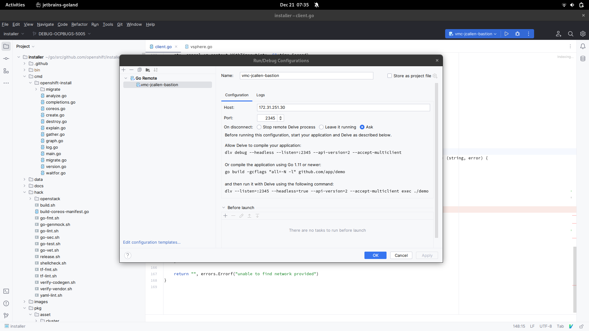

#### Customer section

Install rr
https://rr-project.org/

```
sudo dnf install rr -y
```

Kernel changes for RR
```
sudo sysctl kernel.perf_event_paranoid=-1
sudo sysctl kernel.kptr_restrict=0
```

Run RR with `openshift-install`
```
rr openshift-install create cluster --log-level debug
```

after install failed run

```
rr pack
```

**WARNING** this will be very large and should be encrypted
Tar the e.g. `/home/<user>/.local/share/rr` directory

```
tar -czvf openshift-debug.tar.gz ${HOME}/.local/share/rr
```

Grab the `debug.log` from the directory openshift-install was executed from.


## engineering

### new func to write obj to spew.Fdumpf

https://github.com/jcpowermac/installer/blob/DEBUG-OCPBUGS-5005/pkg/asset/installconfig/vsphere/client.go#L81-L90

```
pkg/asset/installconfig/vsphere/client.go:99:   writeToDebug(ccr, err)
pkg/asset/installconfig/vsphere/client.go:119:  writeToDebug(ccr, datacenter, cluster, path)
pkg/asset/installconfig/vsphere/client.go:123:  writeToDebug(networks, err)
pkg/asset/installconfig/vsphere/client.go:139:  writeToDebug(netObj, name, err)
pkg/asset/installconfig/vsphere/client.go:154:  writeToDebug(networks, err)
pkg/asset/installconfig/vsphere/client.go:158:          writeToDebug(name, err)
```

### using rr with installer


The installer must be built with removing and adding compiler flags

Comment out LDFLAGS
To the `go build` command add `"all=-N -l"`

```
#LDFLAGS="${LDFLAGS} -s -w"
+go build ${GOFLAGS} -gcflags "all=-N -l" -ldflags "${LDFLAGS}" -tags "${TAGS}" -o "${OUTPUT}" ./cmd/openshift-install
```

### delve replay

#### install rr locally
```
sudo dnf install rr -y
```

kernel settings
```
sudo sysctl kernel.perf_event_paranoid=-1
sudo sysctl kernel.kptr_restrict=0
```

#### debug process, goland, rr, delve, installer

If you have CPU compatibility issues use dlv remotely with a server-based cpu (VMC or IBM).
```
dlv replay --backend=rr --headless --listen=:2345 --api-version=2 --accept-multiclient /home/jcallen/.local/share/rr/openshift-install-0
```
then use goland to debug



Otherwise you should be able to select the trace directly from goland, `Run` -> `Debug Saved Trace...`

Finally debug like you normally would, checkpoints, steps, etc...
